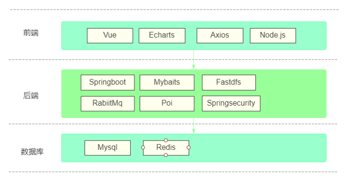
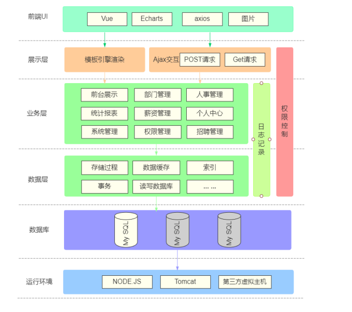
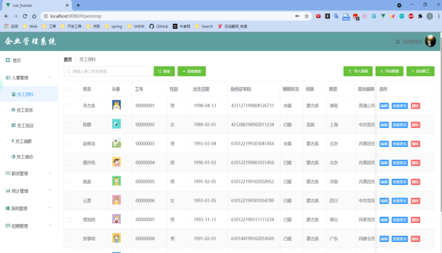
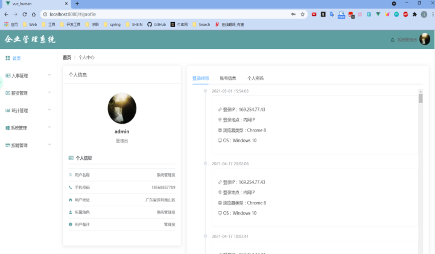
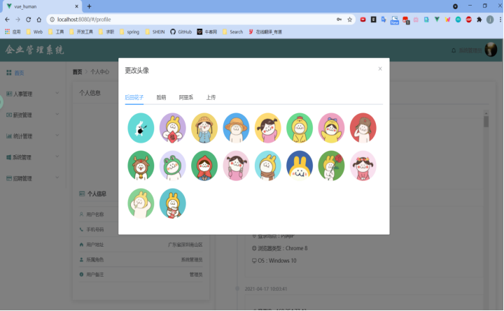

# 企业管理系统
该系统实现参考：

江南一点雨 【微人事】 https://github.com/lenve/vhr

孔令文 【vue-bytedanceJob】 https://github.com/konglingwen94/vue-bytedanceJob

## 一、项目介绍
本项目采用前后端分离模式，使用 SpringBoot、Vue、Mysql、Mybatis 等技术开发。主要包括
系统前台（企业简介、职位查询、简历投递）、系统后台（人事管理、薪资管理、招聘管理、统计分析）等模块。

主要技术栈：

## 二、系统架构

## 三、主要模块
1、前台模块

2、后台模块

员工资料

个人中心

修改资料

员工信息统计

